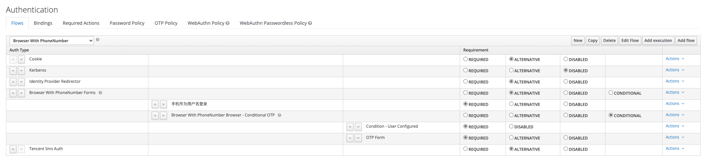
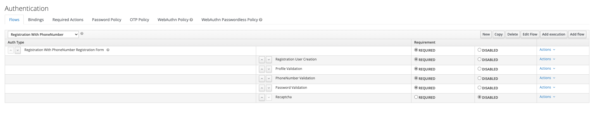
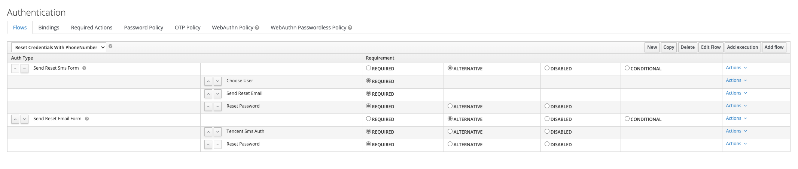
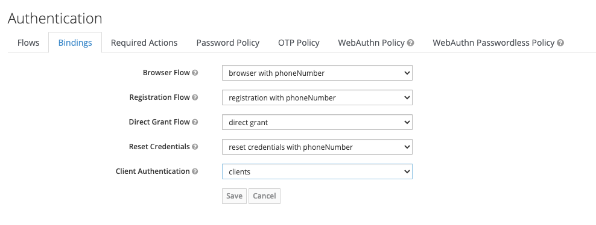

# keycloak使用和功能扩展

## 手机验证码登录集成

1. 下载代码`git@github.com:zhangzhenling/keycloak-sms-tencent.git`

   ```sh
   $ git clone git@github.com:zhangzhenling/keycloak-sms-tencent.git
   ```

2. 执行打包命令：`mvn install`

3. 将`target`文件夹中的`keycloak-sms-auth-spi-10.0.2-jar-with-dependencies.jar`拷贝到keycloak项目的`providers`文件夹中

4. 将主题样式文件`themes`合并到`keycloak`的`themes`目录中

5. 在keycloak Admin Console管理控制台页面，选择相应域下的`Authentication`菜单

6. 创建flows

   1. 登录流程，复制Browser，然后修改成如下图所示：

      

   2. 注册流程，复制Registration，修改为如下图所示：

      

   3. 重置密码流程，复制Reset Credentials，修改如下图所示：

      

7. 在Bindings中进行操作绑定

   

